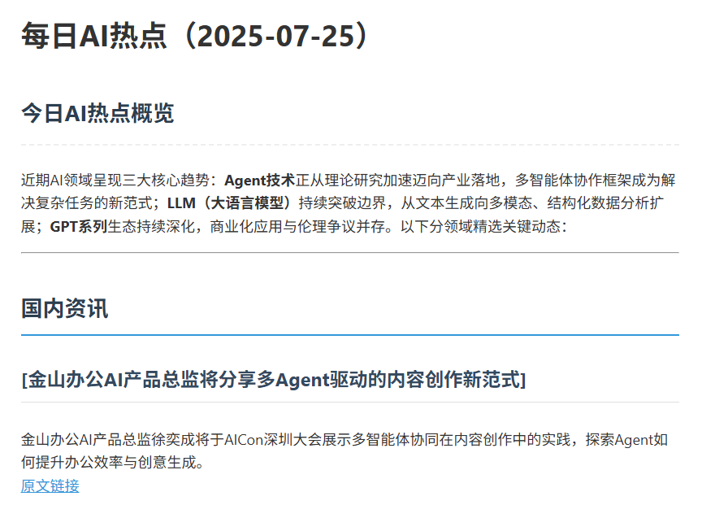

# 每日AI热点助手/Daily-AI-Agent

本项目是一个自动化代理，可以从各种RSS源获取AI新闻，处理内容，使用AI模型生成摘要，并将其保存在本地。

## 功能特性

- 从多个RSS源获取新闻。
- 筛选过去24小时内的文章。
- 删除重复的文章。
- 识别热门话题。
- 使用AI模型生成每日摘要。
- 以Markdown和JSON格式保存摘要。
- 提供调度程序以自动运行该过程。
- 包括一个简单的Web查看器以浏览摘要。

## 应用预览如下：

<div align="center">
  
  <h3 align="center">预览</h3>
</div>

## 项目结构

```
daily-ai-agent/
├── config/
│   ├── .env
│   └── rss_sources.json
├── data/
│   ├── raw/
│   └── processed/
├── scripts/
│   ├── collector.py
│   ├── processor.py
│   ├── scheduler.py
│   ├── view_digest.py
│   └── web_viewer.py
├── templates/
│   ├── digest.html
│   └── index.html
├── main.py
├── requirements.txt
└── README.md
```

## 使用方法

1.  **安装依赖:**
    `pip install -r requirements.txt`

2.  **设置您的DeepSeek API密钥:**
    在 `config` 目录中创建一个 `.env` 文件，并添加您的密钥：
    `DEEPSEEK_API_KEY="your_deepseek_api_key"`
    
    (可选) 如果您使用自定义或代理的DeepSeek API端点，还可以添加：
    `DEEPSEEK_BASE_URL="your_custom_api_base_url"`

3.  **运行程序:**
    使用 `python main.py [action]` 来执行不同的任务。

    - **手动生成简报:**
      ```bash
      python main.py run
      ```

    - **启动定时任务:**
      ```bash
      python main.py schedule
      ```

    - **在命令行中查看历史简报:**
      ```bash
      python main.py view
      ```

    - **启动Web服务器来查看简报:**
      ```bash
      python main.py web
      ```
      然后在浏览器中打开 `http://127.0.0.1:5000`。 
